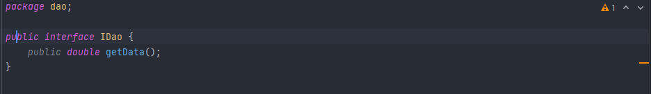
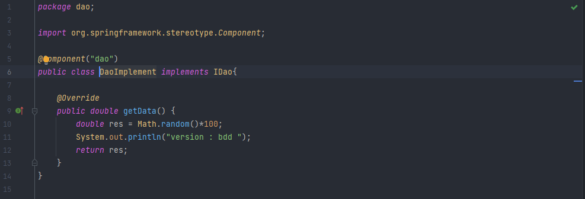
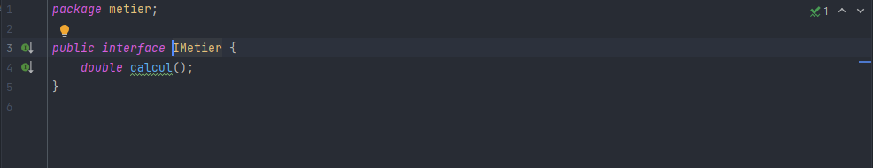
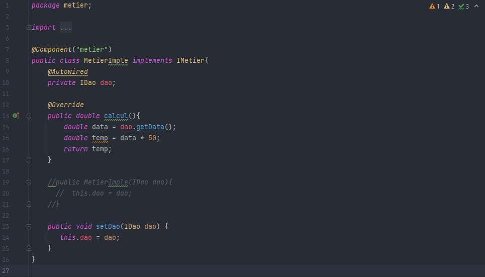
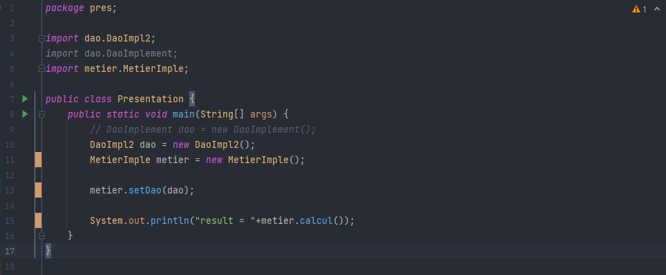
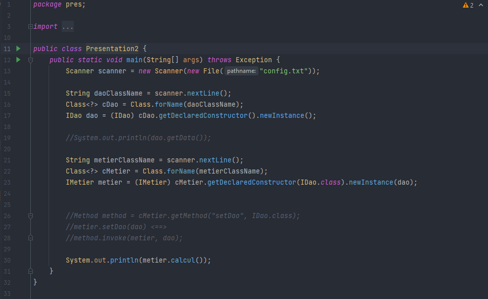
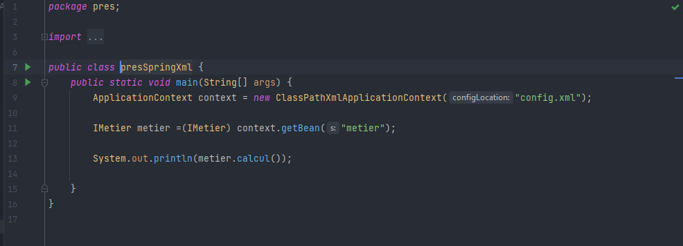
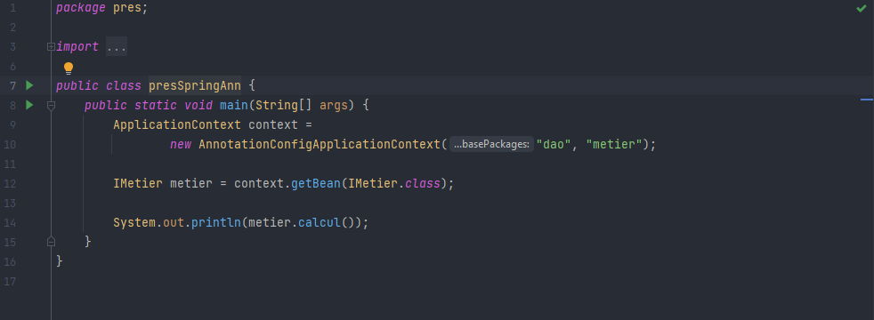

<h3>Compte rendu</h3>

<h5>I- Interfaces</h5>

<h6>1- DAO</h6>

<h6> > Une implementation de l'interface dao</h6>

<h6>2- Metier</h6>

<h6> > Une implementation de l'interface metier</h6>

<h5>II- Presentation</h5>

<h6>1- Instanciation statique</h6>

<h6>2- Instanciation dynamique</h6>

<h6>3- Spring framework (XML)</h6>

<h6>4- Spring framework(Annotations)</h6>

